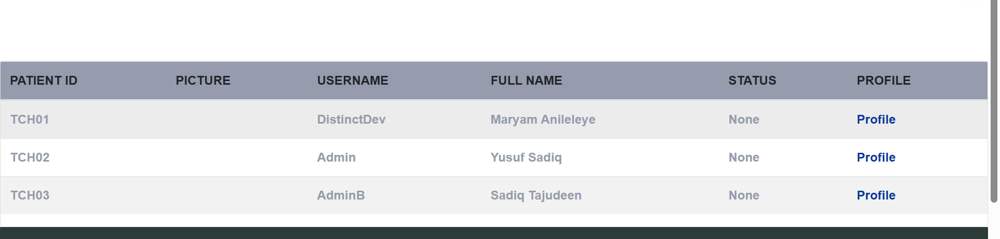
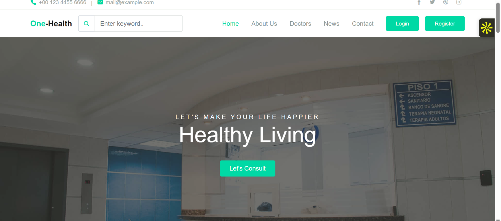
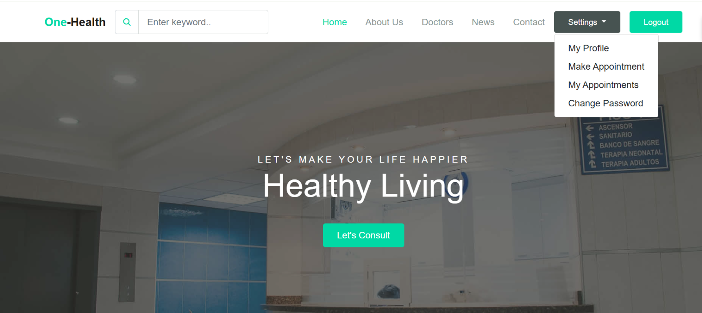
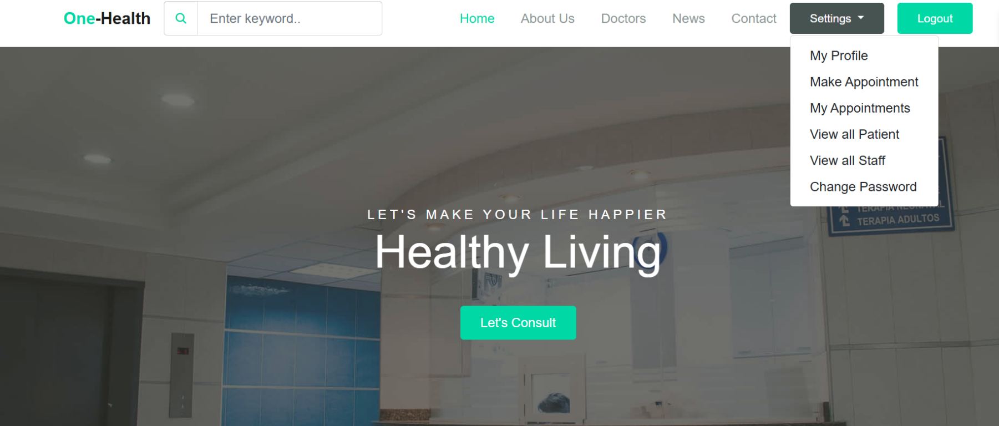

# TechCare - Hospital Management System 🏥


TechCare is an all-in-one hospital management system built with Django. It simplifies the healthcare workflow by managing appointments,
doctor availability, departmental services, and patient interactions.
It also supports automatic doctor assignment and real-time notifications using Telex integration.

---

## 📚 Table of Contents

[Features](#features)
[Sample Screenshots](#sample-screenshots)
[Technologies Used](#technologies-used)
[Installation](#installation)
[Usage](#usage)
[Production Deployment (Render)](#production-deployment-render)
[Project Structure](#project-structure)
[Apps Description](#apps-description)
[Contributing](#contributing)
[License](#license)
[Acknowledgments](#acknowledgments)

---

## ✨ Features

✅ User Authentication & Authorization
📅 Appointment Management
👨‍⚕️ Doctor Assignment System (Automatic)
🏥 Department & Services Management
🔔 Real-time Notifications (Telex Integration)
💳 Payment Processing
📊 Admin Dashboard
🌐 Environment-based Configuration (Dev & Prod)

---

## 🛠 Technologies Used

**Backend**: Django 5.1.6
- **Database**: PostgreSQL (Production), MySQL (Development)
- **Server**: Uvicorn (ASGI)
- **Frontend**: Bootstrap 5
- **Notifications**: Telex Integration
- **Deployment**: Render (Production)
- **Static File Handling**: Whitenoise

---

## 🧰 Installation

### Prerequisites

- Python 3.11+
- Redis Server
- PostgreSQL/MySQL
- Virtual Environment

### Setup Instructions

1. **Clone the repository**:
   ```bash
   git clone https://github.com/Maryam-20/one-health.git
   cd techcare
   ```

2. **Create and activate a virtual environment**:
   ```bash
   python -m venv .venv
   source .venv/bin/activate  # For Linux/macOS
   .venv\Scripts\activate     # For Windows
   ```

3. **Install dependencies**:
   ```bash
   pip install -r requirements.txt
   ```

4. **Create a `.env` file** in the root directory:
   ```env
   DEBUG=True
   SECRET_KEY=your_secret_key
   DB_NAME=your_db_name
   DB_USER=your_db_user
   DB_PASSWORD=your_db_password
   DB_HOST=localhost
   DB_PORT=3308
   ```

5. **Run database migrations**:
   ```bash
   python manage.py migrate
   ```

6. **Create an admin user**:
   ```bash
   python manage.py createsuperuser
   ```

7. **Start the development server**:
   ```bash
   python manage.py runserver
   ```

---

## 📸 Sample Screenshots

These screenshots showcase the hospital portal, patient list, and homepage experience for the One-Health application.

### Patient Management View


### Homepage - Public View


### Homepage - Logged In View


### Homepage - Settings Dropdown


---

## 🚀 Usage

Once the server is running:

- Navigate to `http://127.0.0.1:8000/`
- Register or login as a user.
- Create an appointment by selecting a department.
- System automatically assigns an available doctor and updates their availability.
- Admins can view and manage users, doctors, and appointments through the dashboard.

---

## ☁️ Production Deployment (Render)
Link : https://one-health-0oxk.onrender.com

The project is configured to be deployed on **Render**, and includes:

- PostgreSQL database connection
- Uvicorn for ASGI support
- Whitenoise for serving static files
- Environment-based configuration with `.env` variables
- Health checks for database and Telex notifications

### Required Environment Variables (Production)

```env
ENVIRONMENT=production
DEBUG=False
SECRET_KEY=your_secret_key
DATABASE_URL=your_postgres_url
DJANGO_ADMIN_USERNAME=admin
DJANGO_ADMIN_EMAIL=admin@example.com
DJANGO_ADMIN_PASSWORD=secure_password
```

---

## 📁 Project Structure

```
techcare/
├── manage.py
├── requirements.txt
├── static/
├── media/
├── logs/
└── techcare/
    ├── userapp/
    ├── consultapp/
    ├── paymentapp/
    ├── serviceapp/
    ├── telex/
    └── template/
```

---

## 🧩 Apps Description

- **userapp**: Handles user registration, authentication, and profile management.
- **consultapp**: Manages appointment bookings, doctor availability, and scheduling.
- **paymentapp**: Integrates payment handling and billing.
- **serviceapp**: Manages hospital departments and available services.
- **telex**: Integrates Telex for real-time notification services.

---

## 🤝 Contributing

1. Fork the repository.
2. Create a new feature branch:
   ```bash
   git checkout -b feature/AmazingFeature
   ```
3. Commit your changes:
   ```bash
   git commit -m 'Add some AmazingFeature'
   ```
4. Push to your branch:
   ```bash
   git push origin feature/AmazingFeature
   ```
5. Open a Pull Request and describe your changes.

---

## 📝 License

This project is licensed under the **MIT License**.  
See the [LICENSE](./LICENSE) file for more details.

---

## 🙌 Acknowledgments

- [Django Project](https://www.djangoproject.com/)
- [Telex Notifications](https://telex.io/)
- [Render Deployment Platform](https://render.com/)
```

